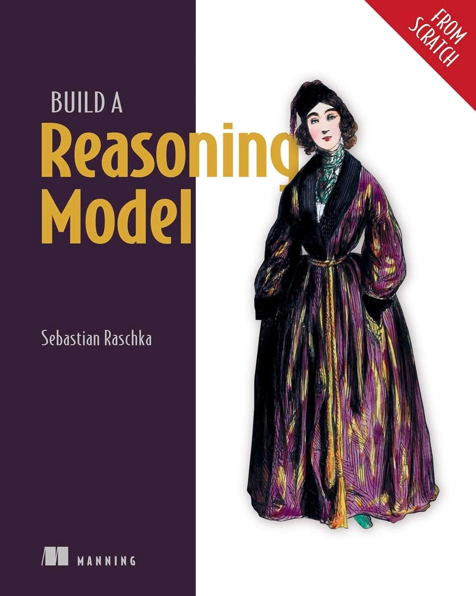
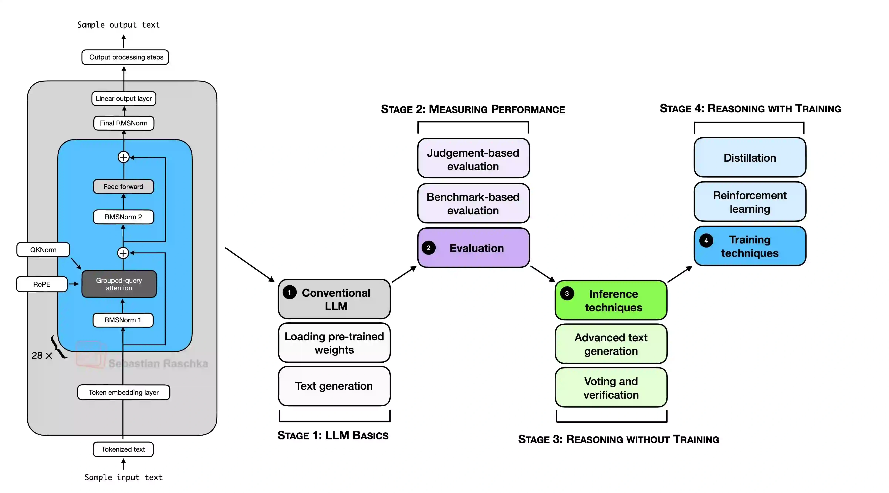

# [Книга][Рашка С.] Build A Reasoning Model (From Scratch) [ENG, 2026]



**Оригинальные искодные коды:**  
https://github.com/rasbt/reasoning-from-scratch

<br>

**Build A Reasoning Model Scratch 1: Motivation & Code Setup**  
https://www.youtube.com/watch?v=Kh9mqTzjuEQ

<br>

In Build a Reasoning Model (From Scratch), you will learn and understand how a reasoning large language model (LLM) works.

Reasoning is one of the most exciting and important recent advances in improving LLMs, but it’s also one of the easiest to misunderstand if you only hear the term reasoning and read about it in theory. This is why this book takes a hands-on approach. We will start with a pre-trained base LLM and then add reasoning capabilities ourselves, step by step in code, so you can see exactly how it works.

The methods described in this book walk you through the process of developing your own small-but-functional reasoning model for educational purposes. It mirrors the approaches used in creating large-scale reasoning models such as DeepSeek R1, GPT-5 Thinking, and others. In addition, this book includes code for loading the weights of existing, pretrained models.

     |

<br>
&nbsp;

The mental model below summarizes the main techniques covered in this book.



<br>
&nbsp;

## Hardware Requirements

The code in the main chapters of this book is designed to mostly run on consumer hardware within a reasonable timeframe and does not require specialized server hardware. This approach ensures that a wide audience can engage with the material. Additionally, the code automatically utilizes GPUs if they are available. That being said, chapters 2-4 will work well on CPUs and GPUs. For chapters 5 and 6, it is recommended to use a GPU if you want to replicate the results in the chapter.

(Please see the [setup_tips](ch02/02_setup-tips/python-instructions.md) doc for additional recommendations.)

&nbsp;

## Exercises

Each chapter of the book includes several exercises. The solutions are summarized in Appendix B, and the corresponding code notebooks are available in the main chapter folders of this repository (for example, [`ch02/01_main-chapter-code/ch02_exercise-solutions.ipynb`](ch02/01_main-chapter-code/ch02_exercise-solutions.ipynb)).

&nbsp;

## Bonus Material

Several folders contain optional materials as a bonus for interested readers:

- **Chapter 2: Generating Text with a Pre-trained LLM**
  - [Optional Python Setup and Cloud GPU Recommendations](ch02/02_setup-tips)
  - [Using a GPU-optimized version of the LLM](ch02/03_optimized-LLM)
  - [Using `torch.compile()` on Windows](ch02/04_torch-compile-windows)
  - [Run inference and chat with the model](ch02/05_use_model)
- **Chapter 3: Evaluating LLMs**
  - [MATH-500 Verifier Scripts](ch03/02_math500-verifier-scripts)
  - [Advanced Parser](ch03/03_advanced-parser) (hybrid LaTeX parser)
- **Chapter 4: Improving Reasoning with Inference-Time Scaling**
  - [Inference Scaling on MATH-500](ch04/02_math500-inference-scaling-scripts) (CoT prompting, self-consistency)
- **Chapter 5: Inference-Time Scaling Via Self-Refinement**
  - [More Inference Scaling on MATH-500](ch05/02_math500-more-inference-scaling-scripts) (Best-of-N, self-refinement)
- **Chapter 6: Training Reasoning Models with Reinforcement Learning**
  - [GRPO scripts](ch06/02_rlvr_grpo_scripts_intro) with a batched mode
- **Chapter 7: Improving GRPO for Reinforcement Learning**
  - [Advanced GRPO scripts](ch07/03_rlvr_grpo_scripts_advanced) (including DeepSeek-V3.2-, Olmo3-, and GDPO-style training)
  - [Download training checkpoints](ch07/04_download_trainining_checkpoints) (how to download and use the chapter 6 and 7 GRPO checkpoints)
- **Chapter 8: Distilling Reasoning Models for Efficient Reasoning**
  - [Generate distillation data](ch08/02_generate_distillation_data) (teacher-output generation via Ollama or OpenRouter)
  - [Train with distillation](ch08/04_train_with_distillation) (including single-example and batched distillation scripts)
  - [Download training checkpoints](ch08/05_download_training_checkpoints) (how to download and use the chapter 8 distillation checkpoints)
  - [Use Qwen3 with Hugging Face](ch08/06_use_via_huggingface) (how to use the base model and chapter 6-8 checkpoints with `transformers`)
- **Appendix F: Common Approaches to LLM Evaluation**
  - [MMLU Evaluation Methods](chF/02_mmlu)
  - [LLM leaderboards](chF/03_leaderboards)
  - [LLM-as-a-judge](chF/04_llm-judge)
- **Appendix G: Building a Chat Interface**
  - [Chat interface code](chG/01_main-chapter-code)

&nbsp;

## Questions, Feedback, and Contributing to This Repository

For common problems, please see the [Troubleshooting Guide](./troubleshooting.md).

I welcome all sorts of feedback, best shared via the [Manning Discussion Forum](https://livebook.manning.com/forum?product=raschka2&page=1) or [GitHub Discussions](https://github.com/rasbt/reasoning-from-scratch/discussions). Likewise, if you have any questions or just want to bounce ideas off others, please don't hesitate to post these in the forum as well.

Please note that since this repository contains the code corresponding to a print book, I currently cannot accept contributions that would extend the contents of the main chapter code, as it would introduce deviations from the physical book. Keeping it consistent helps ensure a smooth experience for everyone.

&nbsp;

## Citation

If you find this book or code useful for your research, please consider citing it.

Chicago-style citation:

> Raschka, Sebastian. _Build A Reasoning Model (From Scratch)_. Manning, 2025. ISBN: 9781633434677.

BibTeX entry:

```
@book{build-llms-from-scratch-book,
  author       = {Sebastian Raschka},
  title        = {Build A Reasoning Model (From Scratch)},
  publisher    = {Manning},
  year         = {2025},
  isbn         = {9781633434677},
  url          = {https://mng.bz/lZ5B},
  github       = {https://github.com/rasbt/reasoning-from-scratch}
}
```
